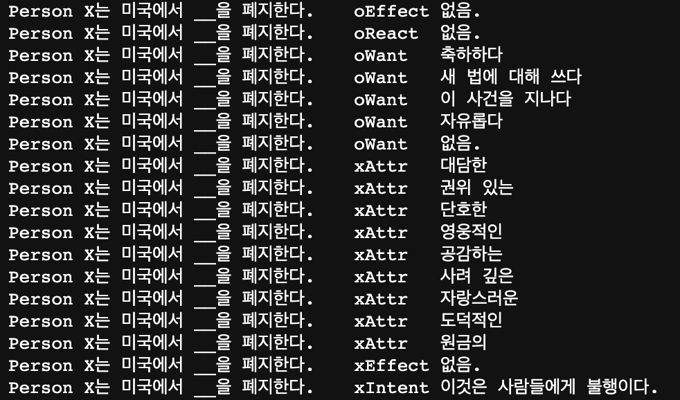

## ATOMIC_trans
ATOMIC_trans는 기존의 [ATOMIC2020][1]을 한국어로 번역하여 구축한 일반 상식 기반의 지식 그래프입니다.

이 떄, ATOMIC의 `{Event-Relation-Inference}`의 Triple에서, Event와 Inference의 관계 정보를 나타내는 Relation 태그를 그대로 사용하고, ATOMIC2020이 정의하고 있는 일반 상식 정보가 훼손되지 않도록 Event와 Inference를 독립적으로 번역합니다.

번역 작업은 NAVER Cloud Platform에서 제공하는 [Papago API][2]를 통해 진행했습니다.

## Structure
[ATOMIC_trans][3](HCLT 버전)는 csv 형식으로 구성되어 있습니다.

아래의 그림은 ATOMIC2020을 번역한 ATOMIC_trans의 일부분입니다.

[1]: https://allenai.org/data/atomic-2020
[2]: https://www.ncloud.com/product/aiService/papagoTranslation
[3]: https://github.com/jooinjang/Ko-ATOMIC/tree/main/ATOMIC_trans