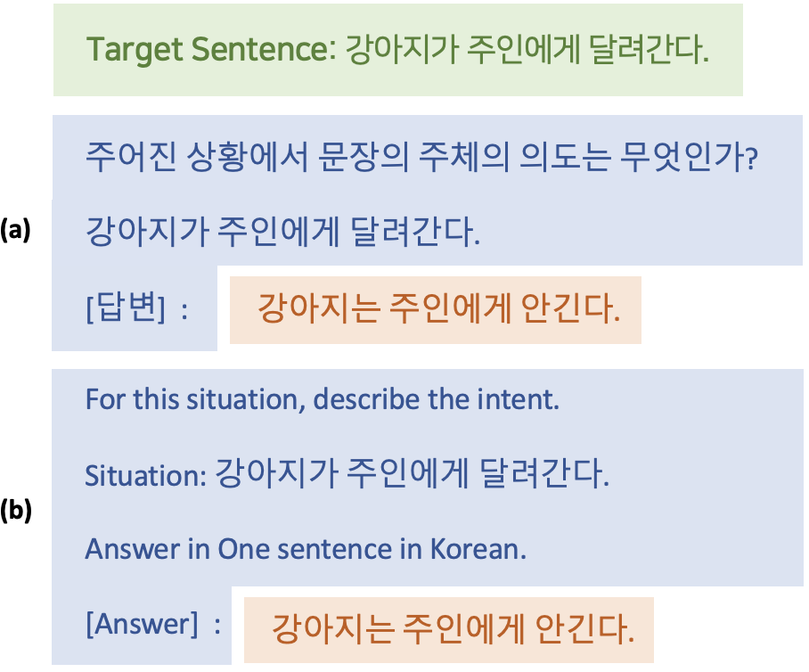

## KommonGenKG
한국어 일반 상식 추론 데이터셋인 [KommonGen][1]을 활용하여, ATOMIC과 같은 형태의 `{Event, Relation, Inference}`의 Triple을 생성합니다.

Triple 생성에는 [OpenAI][1]의 GPT-3 davinci 모델 API를 사용했습니다.

GPT-3의 입력 프롬프트는 Event와 Inference의 관계를 나타내는 Relation Tag와 관련된 서술을 요구하는 질문, KommonGen 데이터셋에 포함된 일반 상식을 내포하는 완성형 문장, 그리고 해당 부분부터 문장을 생성하기로 사전에 정의한 Simple End Token으로 구성되어 있습니다.

이 때, 입력 프롬프트를 구성하는 텍스트 중, KommonGen의 문장을 제외한 부분을 영어로 구성한 것을 KommonGenKG_En이라고 하고, 한국어로 구성한 것을 KommonGenKG_Ko라고 합니다.

이는 GPT-3가 사전 학습될 때 한국어 코퍼스보다는 영어 코퍼스를 훨씬 더 많이 학습했을 것이며, 따라서, 한국어로 입력 프롬프트를 구성했을 때보다, 영어로 입력 프롬프트를 구성했을 때 더 유의미한 생성 결과를 얻을 수 있을 것이라는 가정에 기반합니다.

아래의 그림은 Ko-ATOMIC(HCLT 버전)에서 표현하는 GPT-3에 사용된 입력 프롬프트의 예시입니다.



## Structure
[KommonGenKG][3](HCLT 버전)는 jsonl 형식으로 아래와 같은 구조로 구성되어 있습니다.

```
{
    'original_text': str,
    'prompt': str,
    'relation_type: str,
    'completion': str
}
```
각 key와 value에 대한 설명은 아래와 같습니다.
- original_text: KommonGen의 완성형 문장
- prompt: 질문, 완성형 문장, 종료 토큰을 모두 포함하는 입력 프롬프트
- relation_type: 관계 태그
- completion: GPT-3 davinci 모델이 prompt를 입력으로 받아 생성한 텍스트


[1]: https://github.com/nlpai-lab/KommonGen
[2]: https://beta.openai.com/overview
[3]: https://github.com/jooinjang/Ko-ATOMIC/tree/main/KommonnGenKG